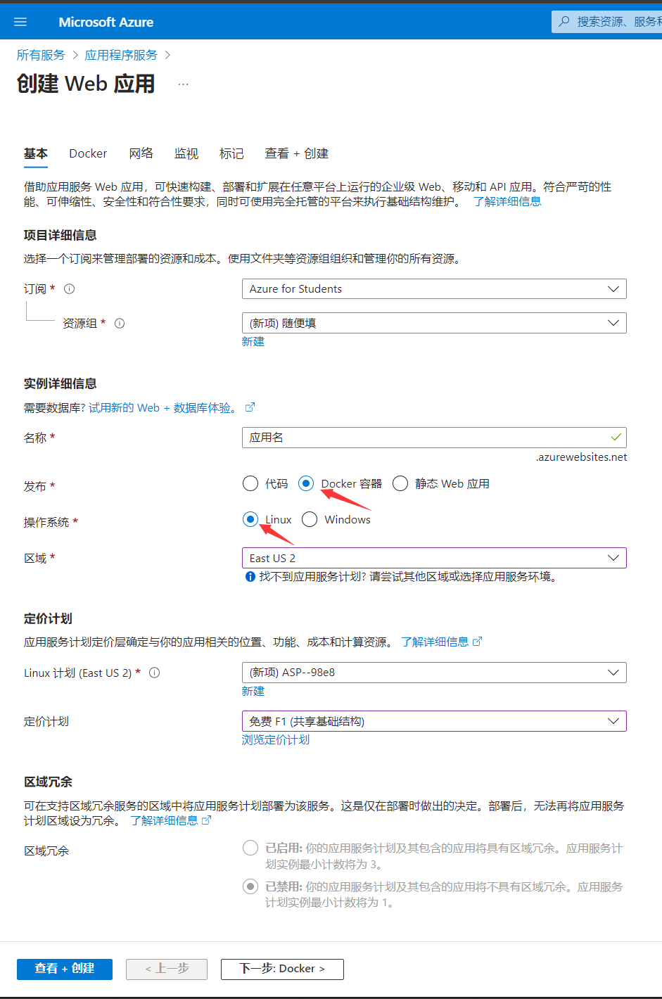
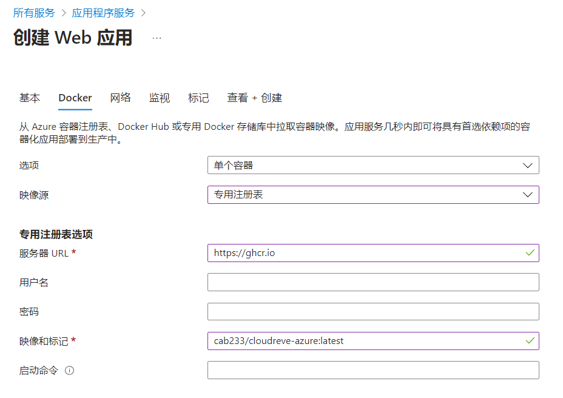

# Cloudreve-azure

> 仅适合个人小范围使用

## 部署

### 前置需求

- 需要拥有一个学生账号或信用卡验证账号
- 云数据库，例如 [supabase](https://supabase.com/database)
- 会使用 Git 和 Docker

### 部署步骤

1. Fork 本项目，然后 git clone 你刚刚 Fork 的仓库
2. 在本地使用 docker build 构建镜像，镜像名为 ghcr.io/<你的用户名>/<镜像名称>:latest，然后 docker pull 到 GitHub Package，在 Package setting 中更改为公共镜像并连接到你的仓库
3. 登录 [Azure 门户](https://portal.azure.com/#allservices)，选择`应用程序服务`
4. 左上角点击`创建` -> `Web 应用`
5. 除了箭头指示的必选项，其余选项根据自身实际选择，然后点击下一步
   
6. `选项`选择单个容器，`映像源`选择专用注册表，`服务器URL`填写 https://ghcr.io，`用户名`填写你的 GitHub 用户名，`映像和标记`填写你 docker build 时的镜像名，密码需要填写你在 GitHub 中生成一个 Token，其权限至少有 `repo`、`read:packages`
   
7. 一直点击下一步，最后点击创建，然后等待创建完成
8. 选择`应用服务设置`，打开`文件系统`，根据需要填写配额和保留期，然后保存
9. 选择`配置`，填写环境变量，然后保存
10. 选择`概述`，然后点击重启
11. 选择`配置中心` -> `日志`，查看生成的密码

## 变量

详细介绍见[官方文档](https://docs.cloudreve.org/getting-started/config)

> 即使 Azure 的应用程序服务可以实现数据持久化从而使用 sqlite，但依然推荐使用云数据库

| 变量名         | 必填 | 默认值 | 描述         |
| :------------- | ---- | ------ | ------------ |
| DB_TYPE        | 是   |        | 数据库类型   |
| DB_PORT        | 是   |        | 数据库端口   |
| DB_USER        | 是   |        | 数据库用户名 |
| DB_PASSWORD    | 是   |        | 数据库密码   |
| DB_HOST        | 是   |        | 数据库地址   |
| DB_NAME        | 是   |        | 数据库名称   |
| DB_TABLEPREFIX | 是   |        | 数据表前缀   |

## 其他

- 免费计划无法绑定自己的域名
- 可在创建的实例管理面板中查看`配额`
- 容器在一段时间内没有连接时会休眠，可用 uptimerobot 定时访问，貌似不会消耗 CPU 时间的配额
- 若需升级 Cloudreve 版本，则在 Dockerfile 中修改 VERSION 的值

---

鸣谢

- [lyj0309/pan](https://github.com/lyj0309/pan)
- [chuyua/cloudreve-render](https://github.com/chuyua/cloudreve-render)
